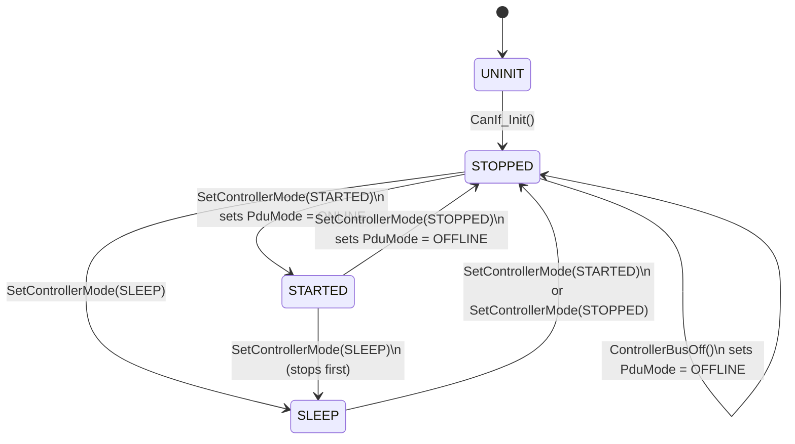
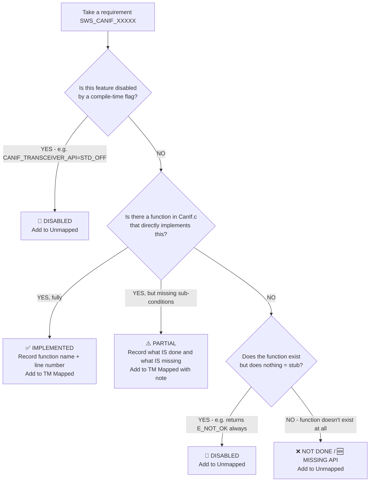
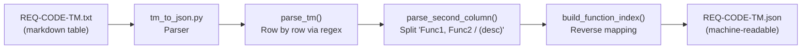
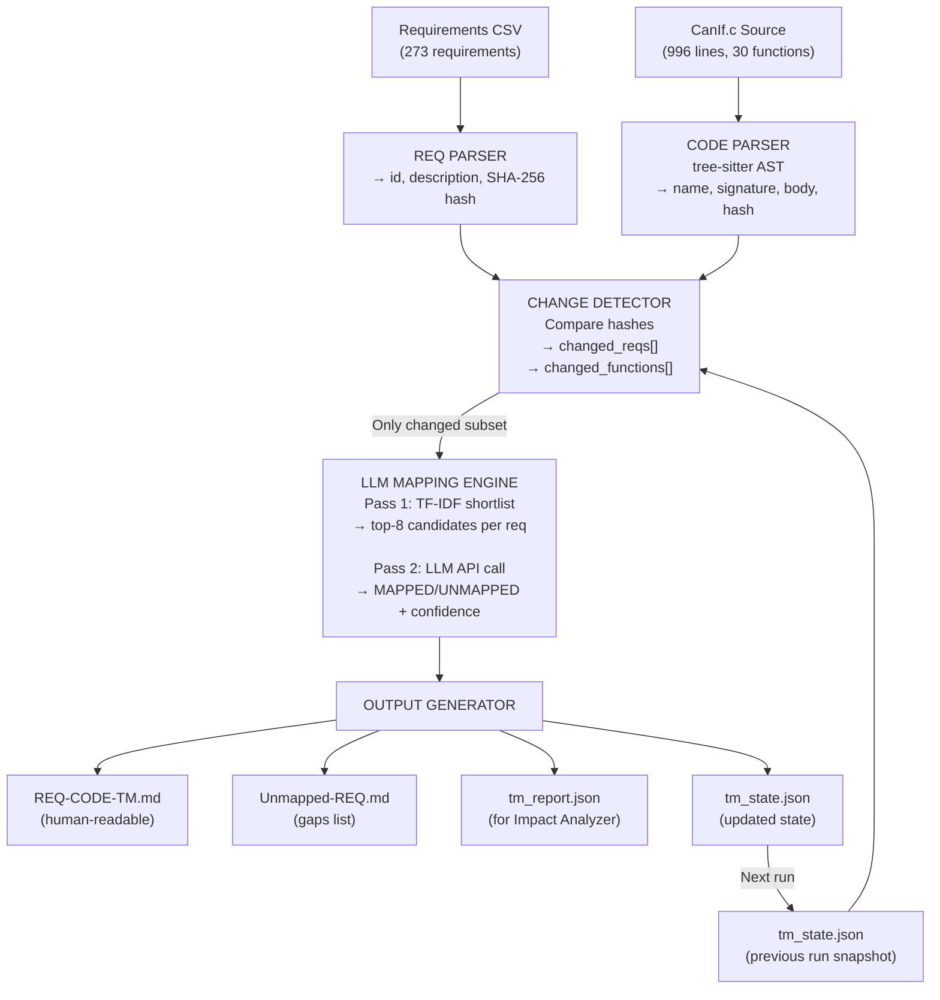
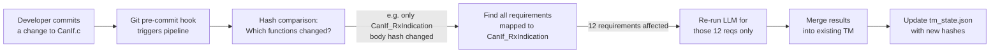
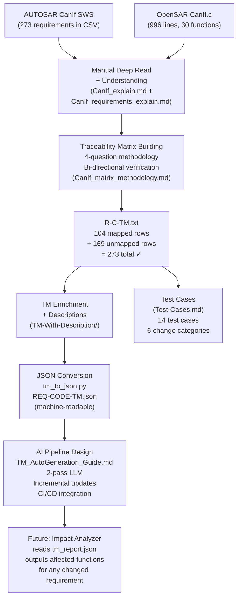

# Weekly Progress Report — CANIF Traceability Work
**Project:** Optimizing SDLC using AI — Category 2: Implementation  
**Module:** AUTOSAR CanIf (CAN Interface) AR 4.0.3 — OpenSAR  
**Week Ending:** 2026-05-05  
**Prepared by:** Ahmed Mohamed  

---

## Table of Contents

1. [Project Big Picture (What We Are Doing and Why)](#1-project-big-picture)
2. [What is CanIf and Why It Was Chosen](#2-what-is-canif-and-why-it-was-chosen)
3. [Deep Understanding of CanIf.c](#3-deep-understanding-of-canifc)
4. [Deep Understanding of the Requirements CSV](#4-deep-understanding-of-the-requirements-csv)
5. [Building the Traceability Matrix — Methodology](#5-building-the-traceability-matrix--methodology)
6. [TM Corrections and Integrity Validation](#6-tm-corrections-and-integrity-validation)
7. [TM with Descriptions (Enhanced Version)](#7-tm-with-descriptions-enhanced-version)
8. [TM to JSON Conversion](#8-tm-to-json-conversion)
9. [Logical Test Cases for Requirement Changes](#9-logical-test-cases-for-requirement-changes)
10. [TM Auto-Generation Design (AI Pipeline)](#10-tm-auto-generation-design-ai-pipeline)
11. [Summary of All Deliverables](#11-summary-of-all-deliverables)
12. [What Comes Next](#12-what-comes-next)

---

## 1. Project Big Picture

### 1.1 Overarching Goal

The graduation project is titled **"Optimizing Software Development Life Cycle (SDLC) using Artificial Intelligence"**. The SDLC is divided into 4 categories:

```
┌─────────────────────────────────────────────────────────────┐
│        SDLC Optimization using AI — 4 Categories           │
├──────────────────┬──────────────────┬────────────┬──────────┤
│  Category 1      │  Category 2      │Category 3  │Category 4│
│  Analysis &      │  Implementation  │  Testing   │Maintenance│
│  Design          │  (THIS WEEK)     │            │          │
└──────────────────┴──────────────────┴────────────┴──────────┘
```

### 1.2 This Week's Focus Area

All work done this week belongs to **Category 2 — Implementation**. Within this category, there are two specific capabilities being built:

| Capability | Description | Status This Week |
|:---|:---|:---:|
| **Code Traceability Check** | Given a requirement document + source code, generate a matrix that maps every requirement to the function(s) that implement it | Complete (manual TM done, auto-generation designed) |
| **Change Impact Propagation** | Given a changed requirement, determine which code functions must be updated | Test cases written; AI pipeline designed |

### 1.3 Why This Matters

In automotive embedded software (like AUTOSAR), there are hundreds of requirements per module. When a requirement changes:
- A developer must manually search the code to find what is affected
- This is error-prone, time-consuming, and hard to audit
- The goal is to make this **automated, AI-driven, and fast**

The **Traceability Matrix (TM)** is the core artifact that makes change impact propagation possible. Without an accurate TM, you cannot know which functions are affected by a requirement change.

---

## 2. What is CanIf and Why It Was Chosen

### 2.1 AUTOSAR Layer Position

```
┌──────────────────────────────────────────────────────┐
│  Application / RTE (Runnable Entities)               │
├──────────────────────────────────────────────────────┤
│  COM / DCM / NM (Network Management)                 │
├──────────────────────────────────────────────────────┤
│  PduR  │  CanNm  │  CanTp  │  CDD (Custom Drivers)  │ ← upper layers
├──────────────────────────────────────────────────────┤
│              CanIf  — CAN Interface  ★               │ ← WE ARE HERE
├──────────────────────────────────────────────────────┤
│              CAN Driver (Can.c / Can.h)               │ ← hardware driver
├──────────────────────────────────────────────────────┤
│              CAN Hardware (Physical Bus)              │
└──────────────────────────────────────────────────────┘
```

### 2.2 What CanIf Does

CanIf is the **middleman** between software and hardware on a CAN network. It solves these problems:

| Problem | CanIf Solution |
|:---|:---|
| Upper layers don't know which physical CAN controller to use | CanIf maps logical PDU IDs to hardware handles (HTH/HRH) |
| Multiple CAN hardware drivers may exist | CanIf provides one unified API regardless of hardware |
| Incoming CAN frames must be routed to the right upper layer | CanIf uses an Rx PDU table + software filtering |
| CAN bus ON/OFF control is needed | CanIf manages controller modes and PDU channel modes |

### 2.3 Key AUTOSAR Terms Used Throughout This Work

| Term | Meaning |
|:---|:---|
| **L-PDU** | Link Layer Protocol Data Unit — a complete CAN frame (ID + DLC + data) |
| **L-SDU** | The data payload only (without the CAN ID header) |
| **HTH** | Hardware Transmit Handle — reference to a CAN transmit mailbox in hardware |
| **HRH** | Hardware Receive Handle — reference to a CAN receive mailbox in hardware |
| **PDU ID** | A software-level numeric ID assigned to each message |
| **DLC** | Data Length Code — how many bytes are in the CAN frame (0 to 8) |
| **BasicCAN** | A receive mailbox that can accept multiple CAN IDs (needs software filter) |
| **FullCAN** | A receive mailbox fixed to exactly one CAN ID |
| **DET** | Default Error Tracer — AUTOSAR's error reporting service |
| **SWS** | Software Specification — the AUTOSAR document defining requirements |

### 2.4 Why OpenSAR Was Chosen

OpenSAR is an open-source AUTOSAR implementation. The specific file analyzed is `CanIf.c` which contains **996 lines of C code** and **30 functions**. It implements approximately 36% of the full AUTOSAR CanIf specification — which makes it an excellent real-world case study: not too simple, not too complex, with clearly defined implemented vs. not-implemented boundaries.

---

## 3. Deep Understanding of CanIf.c

### 3.1 What Was Done

Before touching any requirements, I read and fully understood all 996 lines of `CanIf.c`. I documented this understanding in `New/CanIf_explain.md`. The output of this step was a **complete function inventory** — knowing what every function does, what lines it spans, and which state machines it participates in.

### 3.2 All Functions — Complete Inventory

| # | Function | Lines | Type | Purpose | Implemented? |
|:---:|:---|:---:|:---:|:---|:---:|
| 1 | `CanIf_Arc_FindHrhChannel` | 100–126 | Internal static | Finds which channel owns an HRH number | ✅ |
| 2 | `CanIf_Init` | 131–146 | Public API | Initializes entire CanIf module | ✅ |
| 3 | `CanIf_InitController` | 156–204 | Public API | Re-initializes one CAN controller at runtime | ✅ |
| 4 | `CanIf_PreInit_InitController` | 206–222 | Internal helper | Cold startup init without mode checks | ✅ |
| 5 | `CanIf_SetControllerMode` | 226–318 | Public API | Transitions controller: STOPPED/STARTED/SLEEP | ✅ |
| 6 | `CanIf_GetControllerMode` | 322–335 | Public API | Returns current controller mode | ✅ |
| 7 | `CanIf_FindTxPduEntry` | 344–354 | Internal helper | Looks up Tx PDU config by ID | ✅ |
| 8 | `CanIf_FindRxPduEntry` | 358–364 | Internal | Looks up Rx PDU config (runtime only) | ✅ (runtime cfg) |
| 9 | `CanIf_Arc_GetReceiveHandler` | 366–391 | Internal | Finds HRH config for channel | ✅ (runtime cfg) |
| 10 | `CanIf_Arc_GetTransmitHandler` | 393–418 | Internal | Finds HTH config for channel | ✅ (runtime cfg) |
| 11 | `CanIf_Transmit` | 423–482 | Public API | Sends a CAN frame via the CAN driver | ✅ |
| 12 | `CanIf_ReadRxPduData` | 487–497 | Public API | Read buffered Rx data | ❌ Stub |
| 13 | `CanIf_ReadTxNotifStatus` | 503–527 | Public API | Read Tx notification flag | ❌ Stub |
| 14 | `CanIf_ReadRxNotifStatus` | 533–539 | Public API | Read Rx notification flag | ❌ Stub |
| 15 | `CanIf_SetPduMode` | 544–628 | Public API | Sets PDU channel mode (Tx/Rx on/off) | ✅ |
| 16 | `CanIf_GetPduMode` | 632–644 | Public API | Returns current PDU channel mode | ✅ |
| 17 | `CanIf_SetDynamicTxId` | 647–680 | Public API | Changes CAN ID of a dynamic Tx PDU | ✅ (runtime cfg) |
| 18 | `CanIf_SetTransceiverMode` | 684–691 | Public API | Set transceiver mode | ❌ Stub |
| 19 | `CanIf_GetTransceiverMode` | 693–700 | Public API | Get transceiver mode | ❌ Stub |
| 20 | `CanIf_GetTrcvWakeupReason` | 702–709 | Public API | Get wakeup reason | ❌ Stub |
| 21 | `CanIf_SetTransceiverWakeupMode` | 711–718 | Public API | Set transceiver wakeup mode | ❌ Stub |
| 22 | `CanIf_CheckWakeup` | 722–728 | Public API | Check wakeup event | ❌ Stub |
| 23 | `CanIf_CheckValidation` | 730–736 | Public API | Validate wakeup | ❌ Stub |
| 24 | `CanIf_TxConfirmation` | 742–761 | Callback | CAN driver confirms successful Tx | ✅ |
| 25 | `CanIf_RxIndication` | 763–898 | Callback | CAN driver signals frame received | ✅ |
| 26 | `CanIf_CancelTxConfirmation` | 901–914 | Callback | Cancel pending Tx | ❌ Stub |
| 27 | `CanIf_ControllerBusOff` | 917–941 | Callback | CAN driver signals BusOff event | ✅ |
| 28 | `CanIf_SetWakeupEvent` | 943–961 | Callback | CAN driver signals wakeup | ❌ Stub |
| 29 | `CanIf_Arc_Error` | 963–989 | ArcCore callback | CAN driver signals generic error | ✅ |
| 30 | `CanIf_Arc_GetChannelDefaultConfIndex` | 991–994 | ArcCore extension | Returns default config index | ✅ |

### 3.3 Controller State Machine

Every CAN controller channel goes through these states:



### 3.4 PDU Channel Mode — The Software Gate

Independent of the hardware controller mode, there is a software gate per channel that controls whether Tx and/or Rx are allowed:

| Mode | Tx Enabled? | Rx Enabled? | TxConfirmation? |
|:---|:---:|:---:|:---:|
| `CANIF_GET_OFFLINE` | No | No | No |
| `CANIF_GET_ONLINE` | Yes | Yes | Yes |
| `CANIF_GET_TX_ONLINE` | Yes | No | Yes |
| `CANIF_GET_RX_ONLINE` | No | Yes | No |
| `CANIF_GET_OFFLINE_ACTIVE` | No (simulated) | No | Yes (immediate) |
| `CANIF_GET_OFFLINE_ACTIVE_RX_ONLINE` | No (simulated) | Yes | Yes (immediate) |

**OFFLINE_ACTIVE** is a special diagnostic mode: Tx callbacks fire immediately without actually sending to the bus — used for simulation and testing.

### 3.5 The Two Critical Data Paths

**Transmit Path (called by upper layers → hardware):**

```
PduR / CanNm / CanTp
       │
       ▼ CanIf_Transmit()
  ┌─ Validate: initialized, PDU valid, controller STARTED, PDU mode TX_ONLINE/ONLINE
  ├─ Look up Tx PDU config entry
  ├─ Build Can_PduType structure (id, length, sdu, swPduHandle)
  └─ Call Can_Write() → CAN hardware
       │
       ▼ (hardware sends frame → driver confirms)
  CanIf_TxConfirmation()
  ├─ Check PDU mode allows Tx confirmation
  └─ Call entry->CanIfUserTxConfirmation() → PduR_CanIfTxConfirmation() or CanTp_TxConfirmation()
```

**Receive Path (hardware → upper layers):**

```
CAN Hardware receives frame → CAN Driver
       │
       ▼ CanIf_RxIndication(HRH, CanId, CanDlc, CanSduPtr)
  ┌─ Validate: initialized, SduPtr not NULL
  ├─ Find channel from HRH number (via CanIf_Arc_FindHrhChannel)
  ├─ Check PDU mode: if Rx disabled → DROP frame silently
  ├─ Loop through all Rx PDU configs:
  │     ├─ Does HRH match?
  │     ├─ Software filter (MASK): (received_CanId & mask) == (config_CanId & mask)?
  │     ├─ DLC check: received_DLC >= configured_DLC?
  │     └─ Route to upper layer (switch on user type):
  │           PduR  → PduR_CanIfRxIndication()
  │           CanTp → CanTp_RxIndication()
  │           CanNm → CanNm_RxIndication()
  │           J1939Tp → J1939Tp_RxIndication()
  │           Custom → function pointer call
  └─ If no PDU matched → report CANIF_E_PARAM_LPDU error
```

---

## 4. Deep Understanding of the Requirements CSV

### 4.1 Source of Requirements

The file `CanIf_SWS_AR403.csv` contains **273 requirements** extracted from the official AUTOSAR document:  
**AUTOSAR_SWS_CANInterface — AR 4.0.3**

Each requirement has the format `SWS_CANIF_XXXXX` and describes what CanIf **must** do, report, or configure.

### 4.2 Requirements Grouped by Topic (18 Groups)

I organized all 273 requirements into 18 logical groups to understand the full scope:

| Group | Topic | Total Reqs | Implemented | Partial | Not Done |
|:---|:---|:---:|:---:|:---:|:---:|
| A | Architecture & Hardware Abstraction | 17 | 14 | 2 | 1 |
| B | Initialization | 6 | 4 | 1 | 1 |
| C | Controller Mode Management | 8 | 5 | 1 | 2 |
| D | PDU Channel Mode Management | 13 | 7 | 2 | 4 |
| E | Transmission (Tx Path) | 12 | 5 | 2 | 5 |
| F | Tx Buffering | 18 | 0 | 0 | 18 |
| G | Tx Confirmation Callback | 17 | 9 | 2 | 6 |
| H | Reception & Software Filtering | 15 | 8 | 3 | 4 |
| I | Rx Indication Callback Routing | 19 | 12 | 1 | 6 |
| J | Rx Buffering & Notification Status | 18 | 0 | 4 | 14 |
| K | Dynamic PDU (Runtime CAN ID) | 13 | 4 | 0 | 9 |
| L | BusOff Handling | 11 | 6 | 1 | 4 |
| M | Controller & Transceiver Mode Indications | 16 | 0 | 0 | 16 |
| N | Wakeup | 13 | 0 | 3 | 10 |
| O | Transceiver Management | 26 | 0 | 3 | 23 |
| P | Partial Networking (PN) | ~40 | 0 | 0 | ~40 |
| Q | Security Events | 8 | 0 | 1 | 7 |
| R | Advanced APIs | ~20 | 0 | 0 | ~20 |
| **TOTAL** | | **~273** | **~74 (36%)** | **~26** | **~170** |

### 4.3 Key Finding — What is and isn't implemented

**Implemented (~36%):** Core Tx path, core Rx path, initialization, controller modes, PDU modes, BusOff handling, callback routing.

**Not implemented (~64%):** Tx buffering (Group F — 18 reqs), transceiver management (Groups O, N), partial networking (Group P — ~40 reqs), security events (Group Q), advanced APIs (Group R).

> This is not a bug — it is a **deliberate design choice** by OpenSAR. The project provides the core CAN communication path without optional/advanced features.

---

## 5. Building the Traceability Matrix — Methodology

### 5.1 What a Traceability Matrix Is

A **Traceability Matrix** (TM) is a table linking every requirement to the exact code that implements it:

```
Requirement ID  ──────────→  CanIf.c Function(s)
SWS_CANIF_00308  ──────────→  CanIf_SetControllerMode
SWS_CANIF_00026  ──────────→  CanIf_RxIndication
SWS_CANIF_00085  ──────────→  CanIf_Init
...
```

It has two parts:
1. **Mapped requirements** (104 rows) — requirements with code implementations
2. **Unmapped requirements** (169 rows) — requirements with no implementation

### 5.2 Step-by-Step Methodology

The TM was built using a rigorous 4-question process for every requirement:



### 5.3 The 4 Cross-Verification Questions

After mapping each group, I cross-verified both directions:

| Direction | Question Asked |
|:---|:---|
| **Req → Code** | Does every VALIDATE() / error check in code match a requirement? |
| **Code → Req** | Does every `Can_Write()` / `Can_SetControllerMode()` call satisfy the requirement that demands it? |
| **Code orphan check** | Are there code blocks with no requirement backing them? (Found 6 ArcCore vendor extensions) |
| **Req orphan check** | Are there requirements with no code at all? (Found all Group F, M, P, Q, R) |

### 5.4 Status Code Reference

| Symbol | Name | Meaning |
|:---:|:---|:---|
| ✅ | IMPLEMENTED | Requirement fully satisfied by code |
| ⚠️ | PARTIAL | Main behavior done, but a sub-condition is missing |
| ❌ | NOT DONE | No code path even attempts this behavior |
| 🔧 | DISABLED | Feature intentionally turned off via compile flag (not a bug) |
| 🆕 | MISSING API | The entire function doesn't exist in the file |

### 5.5 Final TM Structure

**File: `Traceability-Matrix/R-C-TM.txt`** — 104 mapped rows in markdown table format:

```
| Req ID          | CanIf.c function(s)                                  |
| SWS_CANIF_00308 | CanIf_SetControllerMode                              |
| SWS_CANIF_00026 | CanIf_RxIndication                                   |
| SWS_CANIF_00073 | CanIf_Transmit, CanIf_TxConfirmation, CanIf_RxIndication |
| ...             | ...                                                  |
```

**File: `Traceability-Matrix/TM-With-Description/Unmapped-RE-CODE.txt`** — 169 unmapped rows.

**Integrity invariant enforced:** `104 (mapped) + 169 (unmapped) = 273 (total)` ✓

---

## 6. TM Corrections and Integrity Validation

### 6.1 Three Requirements Removed from TM

During careful review, I found 3 requirements that were **incorrectly mapped** and removed them from the TM, moving them to the Unmapped file:

| Req ID | Was Mapped to | Why Removed |
|:---|:---|:---|
| `SWS_CANIF_00918` | `CanIf_ControllerBusOff` | Requires reporting security event `CANIF_SEV_ERRORSTATE_BUSOFF` to IdsM. `CanIf_ControllerBusOff()` only calls `CanIfBusOffNotification` and sets controller to STOPPED. It has **zero** security event reporting code. |
| `SWS_CANIF_00920` | `CanIf_Arc_Error` | Requires calling the AUTOSAR standard `CanIf_ErrorNotification()` API. `CanIf_Arc_Error()` calls `CanIfErrorNotificaton` — which is an **ArcCore-proprietary callback**, not the AUTOSAR standard API. Different signatures, different semantics. |
| `SWS_CANIF_00921` | `CanIf_Arc_Error` | Same reason as SWS_CANIF_00920. |

### 6.2 One Potentially Duplicate Mapping Confirmed Correct

`SWS_CANIF_00551 → CanIf_RxIndication` was flagged as potentially incorrect (because 00551 is about TxConfirmation naming), but after careful reading of the requirement text and tracing it through the code, it was confirmed correct and kept in the TM.

### 6.3 The Integrity Check

After every change, the count was verified:
```
Mapped rows   = 104
Unmapped rows = 169
Total         = 273  ✓ (matches CSV count)
```

This **integrity check** is a hard invariant — if it doesn't add up, something was miscounted or a requirement was double-entered.

---

## 7. TM with Descriptions (Enhanced Version)

### 7.1 What Was Added

A second, richer version of the TM was created: `TM-With-Description/REQ-CODE-TM.txt`

This version adds the **requirement description text** inline with each mapping:

```
| Req ID          | CanIf.c function(s) / description from csv                    |
| SWS_CANIF_00308 | CanIf_SetControllerMode / The service CanIf_SetControllerMode()
                   shall call Can_SetControllerMode(Controller, Transition) for
                   the requested CAN controller.                               |
```

### 7.2 Why This Is Useful

This version makes the TM **self-explanatory** — anyone reading it understands both:
- Which code implements the requirement
- What the requirement actually says

This is important for the AI pipeline (the automated TM generator needs to see descriptions to make intelligent mapping decisions) and for human audit.

---

## 8. TM to JSON Conversion

### 8.1 What Was Done

A Python script `tm_to_json.py` was written to convert the TM from markdown table format to structured JSON. This is a critical step because **downstream AI tools need machine-readable data**, not markdown.

### 8.2 JSON Structure

The output `REQ-CODE-TM.json` has three sections:

```json
{
  "metadata": {
    "module": "CanIf",
    "standard": "AUTOSAR AR 4.0.3",
    "total_mappings": 104,
    "total_functions": 20,
    "generated": "2026-05-05 00:04:00"
  },
  "mappings": [
    {
      "req_id": "SWS_CANIF_00308",
      "functions": ["CanIf_SetControllerMode"],
      "description": "CanIf_SetControllerMode() shall call Can_SetControllerMode()..."
    },
    {
      "req_id": "SWS_CANIF_00073",
      "functions": ["CanIf_Transmit", "CanIf_TxConfirmation", "CanIf_RxIndication"],
      "description": "..."
    }
  ],
  "function_index": {
    "CanIf_ControllerBusOff": ["SWS_CANIF_00118", "SWS_CANIF_00724", "..."],
    "CanIf_Init":             ["SWS_CANIF_00085", "SWS_CANIF_00864", "SWS_CANIF_00387"],
    "CanIf_RxIndication":     ["SWS_CANIF_00026", "SWS_CANIF_00030", "..."],
    "CanIf_SetControllerMode":["SWS_CANIF_00308", "SWS_CANIF_00311", "..."]
  }
}
```

### 8.3 The Function Index — Why It Matters

The `function_index` is a **reverse lookup**: given a function name, it tells you all the requirements mapped to it.

This is exactly what the **Impact Analyzer** needs: when a requirement changes, look it up in `mappings` to find the functions → then ask "which other requirements share those functions?" by using `function_index`.

### 8.4 Script Architecture



**Key implementation detail:** The second column of the TM can contain multiple function names (comma-separated) and an optional description in parentheses. The parser handles all three formats:
- `CanIf_RxIndication`
- `CanIf_Transmit, CanIf_TxConfirmation`
- `CanIf_RxIndication / (description text)`

### 8.5 Output Statistics

| Metric | Value |
|:---|:---|
| Total requirement mappings | 104 |
| Unique functions covered | 20 |
| Functions with only 1 requirement | 4 |
| Functions with 10+ requirements | `CanIf_RxIndication` (largest — handles Rx pipeline) |

---

## 9. Logical Test Cases for Requirement Changes

### 9.1 Purpose of the Test Cases

The test cases answer the question: **"If requirement X changes, what exact code change must happen, and how do we verify it?"**

These are **logical** test cases — they don't require running hardware or an ECU. They are written to:
1. Define what "correct behavior" looks like for each change category
2. Show exactly which line in `CanIf.c` to change and how
3. Provide precise verification criteria
4. Demonstrate the AUTOSAR engineering rationale

> **Important:** The test case document is completely standalone — it does not reference any AI tool, impact analyzer, or external system. It is a pure AUTOSAR engineering document.

### 9.2 Change Categories Defined

| Category | Symbol | Meaning | Code Change? |
|:---|:---:|:---|:---:|
| Functional | F | Behavior of the system changes (different API called, different return value, different logic) | Always YES |
| Non-Functional | NF | Performance, quality, or structural constraint changes (type width, strictness of a check) | YES (but behavior-preserving for valid inputs) |
| Cosmetic | C | Editorial wording change only — the meaning is identical | Never (NO code change) |
| Cross-Depend 1→N | XD-1N | One requirement change forces updates in **multiple** functions | YES in all affected functions |
| Cross-Depend N→1 | XD-N1 | Multiple requirement changes all converge on **one** function | YES — all must be applied together |
| Combined | CB | All categories simultaneously (realistic sprint scenario) | Mix of YES and NO |

### 9.3 All 14 Test Cases

| TC ID | Req ID(s) | Category | Affected Function(s) | Code Change? |
|:---|:---|:---:|:---|:---:|
| TC-CANIF-F-01 | SWS_CANIF_00308 | Functional | `CanIf_SetControllerMode` | YES — replace 6 call sites |
| TC-CANIF-F-02 | SWS_CANIF_00311 | Functional | `CanIf_SetControllerMode` | YES — change error code constant |
| TC-CANIF-F-03 | SWS_CANIF_00864 | Functional | `CanIf_Init` | YES — change initial PDU mode |
| TC-CANIF-F-04 | SWS_CANIF_00162 | Functional | `CanIf_Transmit` | YES — change return value |
| TC-CANIF-F-05 | SWS_CANIF_00864 | Functional (build-time) | `CanIf_Init` | YES — introduces undeclared identifier → compile error |
| TC-CANIF-NF-01 | SWS_CANIF_00308 | Non-Functional | `CanIf_SetControllerMode` | YES — widen parameter type |
| TC-CANIF-NF-02 | SWS_CANIF_00026 | Non-Functional | `CanIf_RxIndication` | YES — change DLC comparison operator |
| TC-CANIF-C-01 | SWS_CANIF_00423 | Cosmetic | `CanIf_RxIndication` | **NO** — editorial only |
| TC-CANIF-C-02 | SWS_CANIF_00552 | Cosmetic | `CanIf_RxIndication` | **NO** — cross-reference added |
| TC-CANIF-XD1N-01 | SWS_CANIF_00866 | Cross-Depend 1→2 | `CanIf_SetControllerMode` + `CanIf_ControllerBusOff` | YES — both functions |
| TC-CANIF-XD1N-02 | SWS_CANIF_00073 | Cross-Depend 1→3 | `CanIf_Transmit` + `CanIf_TxConfirmation` + `CanIf_RxIndication` | YES (`RxIndication`) + Reviewed (Tx, TxConf) |
| TC-CANIF-XDN1-01 | SWS_CANIF_00311 + 00774 | Cross-Depend 2→1 | `CanIf_SetControllerMode` | YES — 2 changes in 1 function |
| TC-CANIF-XDN1-02 | SWS_CANIF_00389 + 00390 + 00902 | Cross-Depend 3→1 | `CanIf_RxIndication` | YES — 3 structural changes |
| TC-CANIF-CB-01 | 00308 + 00026 + 00423 + 00073 | Combined | 4 functions | Mixed YES/NO per req |

### 9.4 Deep-Dive: Most Complex Test Cases

#### TC-CANIF-XD1N-02 — The 1→3 Fan-Out (Understanding SWS_CANIF_00073)

This test case demonstrates **why the TM is critical** for change impact analysis:

```
Requirement SWS_CANIF_00073 is mapped to THREE functions:
  CanIf_Transmit       → must block Tx in OFFLINE mode
  CanIf_TxConfirmation → must block Tx callbacks in OFFLINE mode  
  CanIf_RxIndication   → must block Rx in OFFLINE mode

If the requirement changes to:
  "OFFLINE mode still blocks Tx and TxConfirmation,
   but NOW Rx indication must remain ENABLED in OFFLINE mode"

Without the TM → developer finds and changes only 1 function (RxIndication)
With the TM    → developer knows ALL 3 functions share this requirement
                 → reviews Transmit and TxConfirmation to confirm they are still correct
                 → no partial fix, no inconsistency
```

The change in code is one line in `CanIf_RxIndication`:
```c
// OLD: OFFLINE blocks Rx
if ((mode == CANIF_GET_OFFLINE) || (mode == CANIF_GET_TX_ONLINE) || ...)

// NEW: OFFLINE no longer blocks Rx
if ((mode == CANIF_GET_TX_ONLINE) || ...)
```

But **two other functions still need to be reviewed** to confirm they handle OFFLINE correctly — this is the power of the TM.

#### TC-CANIF-XDN1-02 — The 3→1 Convergence (Three Changes, One Function)

`CanIf_RxIndication` is affected by three simultaneous requirement changes:

| Change | What Changes in Code |
|:---|:---|
| SWS_CANIF_00389 modified: rejected frames must be logged | Add `DET_REPORTERROR(...)` before `continue` in the filter loop |
| SWS_CANIF_00390 modified: DLC check before filter | Move the `#if CANIF_DLC_CHECK` block above the software filter block |
| SWS_CANIF_00902 modified: DLC check always active | Remove the `#if (CANIF_DLC_CHECK == STD_ON)` guard entirely |

All three must be applied **atomically** in the same code review — implementing only 2 of 3 is a defect.

---

## 10. TM Auto-Generation Design (AI Pipeline)

### 10.1 What Was Designed

A complete technical specification for an **automated pipeline** that generates and maintains the TM using an enterprise LLM API. This is the AI component of Category 2. The spec is in `TM_AutoGeneration_Guide.md`.

### 10.2 The Core Problem It Solves

| Approach | Problem |
|:---|:---|
| Manual TM (what we did this week) | Takes days; requires deep code and requirement expertise; becomes stale when code or requirements change |
| Naive LLM approach (ask LLM about every pair) | 273 requirements × 20 functions = 5,460 API calls per run → too expensive |
| **Designed pipeline** | Uses hashing for incremental updates; 2-pass LLM strategy; runs in seconds for typical changes |

### 10.3 Full Pipeline Architecture



### 10.4 The 2-Pass LLM Strategy

This is the most important design decision — it reduces API calls from O(reqs × functions) to O(reqs × 1):

```
PASS 1 — Embedding / TF-IDF Shortlist (fast, cheap)
  ├── Represent each function as text: name + signature + comments + body excerpt
  ├── Represent each requirement as text: ID + description
  ├── Compute TF-IDF cosine similarity scores
  └── For each requirement → keep top-8 most similar function candidates

PASS 2 — LLM Reasoning (accurate, targeted)
  For each requirement + its top-8 candidates:
  ├── Build a structured prompt with: req text + candidate function bodies
  ├── LLM decides: which functions implement this requirement? Or none?
  └── LLM returns: [{function, confidence: HIGH/MEDIUM/LOW, reason}] or UNMAPPED
```

This reduces the problem from **5,460 calls → 273 calls** (one per requirement).

### 10.5 Incremental Update System

The most innovative part: when only 1 file changes, only the affected requirements are re-evaluated.



**Result:** Instead of re-running the full 273-req pipeline, only 12 LLM calls are made.

### 10.6 Two Operating Modes

| Mode | When Used | Behavior |
|:---|:---|:---|
| `--mode full` | First run, or `--full` flag | Parse everything, run LLM on all 273 requirements |
| `--mode incremental` | Every subsequent change | Detect changes by hash, re-map only affected subset |

### 10.7 CI/CD Integration

The pipeline integrates into development workflow automatically:

| Integration | File | When It Triggers |
|:---|:---|:---|
| Git pre-commit hook | `.git/hooks/pre-commit` | Every `git commit` that touches `.c`, `.h`, or `.csv` files |
| GitHub Actions | `.github/workflows/tm_update.yml` | Every push or PR touching relevant paths |
| GitLab CI | `.gitlab-ci.yml` | Every push to the project |
| File watcher | `tm_pipeline/watcher.py` | Developer running locally — real-time updates |

### 10.8 General-Purpose Design

The pipeline is designed to work for **any module** — not just CanIf. To adapt it to a new module (e.g., CanNm), only one configuration file changes:

```yaml
# tm_config_CanNm.yaml
requirements:
  file: "CanNm_SWS_AR403.csv"
source_code:
  directories: ["OpenSAR/communication/CanNm"]
module:
  name: "CanNm"
```

No Python code changes required.

### 10.9 API Provider Flexibility

The pipeline is not locked to one LLM provider:

| Provider | How to Switch |
|:---|:---|
| Anthropic Claude (default) | `llm.provider: "anthropic"` in config |
| OpenAI GPT-4o | `llm.provider: "openai"` |
| Azure OpenAI | `llm.provider: "azure_openai"` + `base_url_env` |
| Any OpenAI-compatible API | Set `base_url_env` to the enterprise endpoint |

---

## 11. Summary of All Deliverables

### 11.1 Files Produced This Week

| File | Location | What It Contains |
|:---|:---|:---|
| `R-C-TM.txt` | `Traceability-Matrix/` | Final corrected TM — 104 rows, markdown table |
| `REQ-CODE-TM.txt` | `Traceability-Matrix/TM-With-Description/` | TM with full requirement descriptions inline |
| `Unmapped-RE-CODE.txt` | `Traceability-Matrix/TM-With-Description/` | 169 unmapped requirements with reasons |
| `REQ-CODE-TM.json` | `Traceability-Matrix/TM-to-json/` | Machine-readable TM (104 mappings, function index) |
| `tm_to_json.py` | `Traceability-Matrix/TM-to-json/` | Python script for TM → JSON conversion |
| `Test-Cases.md` | `TestCases/` | 14 logical test cases covering all change categories |
| `TM_AutoGeneration_Guide.md` | Root | Full technical spec for the AI TM pipeline |
| `CanIf_explain.md` | `New/` | Complete CanIf.c code explanation (30 functions, state machines) |
| `CanIf_requirements_explain.md` | `New/` | Complete requirements explanation (18 groups, gap analysis) |
| `CanIf_matrix_methodology.md` | `New/` | Methodology documentation for the TM building process |

### 11.2 Key Numbers

| Metric | Value |
|:---|:---|
| Total requirements in CanIf SWS AR403 | **273** |
| Requirements mapped to code (TM rows) | **104** |
| Requirements unmapped (no implementation) | **169** |
| CanIf.c functions (total) | **30** |
| Functions covered by at least one requirement | **20** |
| Test cases written | **14** |
| Change categories covered by test cases | **6** (F, NF, C, XD-1N, XD-N1, CB) |
| Lines of Python (JSON converter) | **127** |
| Pages of TM auto-generation spec | **~50** |
| CanIf implementation coverage | **~36%** (consistent with AR4.0.3 core-only build) |

### 11.3 End-to-End Flow Built This Week



---

## 12. What Comes Next

### 12.1 Immediate Next Steps

| Priority | Task | Description |
|:---:|:---|:---|
| 1 | **Implement the TM automation pipeline** | Write the actual Python code for `tm_pipeline/` — the spec (`TM_AutoGeneration_Guide.md`) is complete and ready to implement |
| 2 | **Build the Impact Analyzer** | Phase 2: reads `tm_report.json`, takes a changed requirement as input, outputs which functions are affected and need review |
| 3 | **Integration testing** | Test the pipeline end-to-end on CanIf, then extend to a second AUTOSAR module (e.g., CanNm) to validate general-purpose design |

### 12.2 How This Week's Work Enables the Impact Analyzer

The JSON output is specifically structured to feed the Impact Analyzer:

```
Engineer changes SWS_CANIF_00308
        │
        ▼
Impact Analyzer reads tm_report.json:
  "SWS_CANIF_00308" → ["CanIf_SetControllerMode"]
        │
        ▼
Look up function_index for "CanIf_SetControllerMode":
  → ["SWS_CANIF_00308", "SWS_CANIF_00311", "SWS_CANIF_00774", 
     "SWS_CANIF_00865", "SWS_CANIF_00866", "SWS_CANIF_00075",
     "SWS_CANIF_00485", "SWS_CANIF_00739"]
        │
        ▼
Output: "8 requirements share this function — review for impact"
Output: "Functions to check: CanIf_SetControllerMode at line 226"
```

### 12.3 Connection to the Broader AI SDLC Project

This week's work provides the **shared foundation** for all downstream AI capabilities in Category 2:

```
TM (this week) ──→ Impact Analyzer (next)
              ├──→ Test Case Generator (Category 3: Testing)
              ├──→ Code Review AI (reads TM for context)
              └──→ Change Propagation Engine (Category 2, Phase 2)
```

Every other AI module in the project consumes the TM. The correctness of this week's work determines the correctness of everything that comes after it.

---

*End of Weekly Progress Report*  
*Generated: 2026-05-05*
